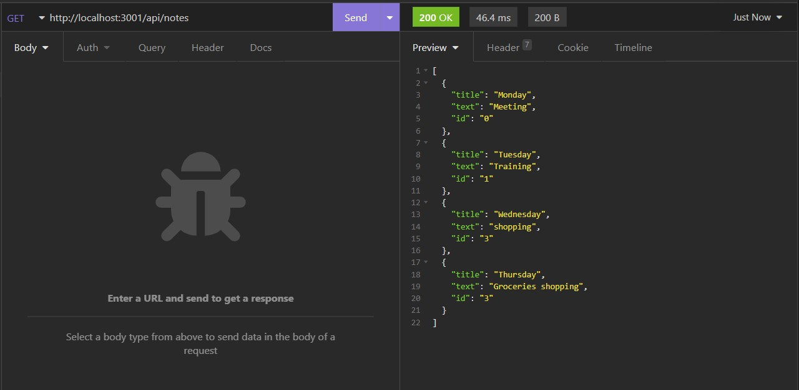
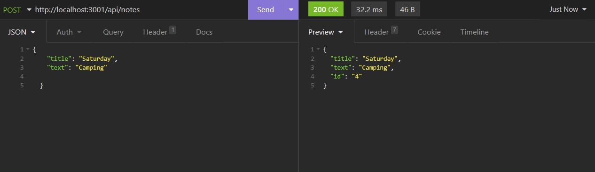
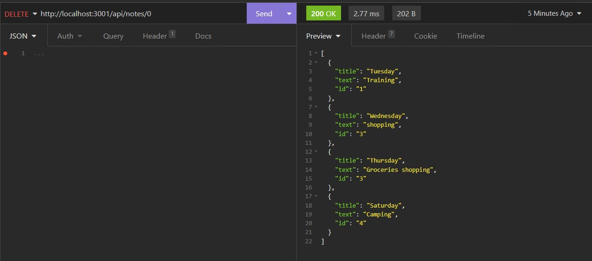

 # Project Name: Note-Taker Appliction

  # Badges: 
  

  # GitHub username: moniquemeas
    
  # Table of Contents
  * [Description](#description)
  * [Installation](#installation)
  * [Technology](#technoloy)
  * [Test](#test)
  * [Contributing](#contributing)
  * [License](#license)
  * [Contact](#contact)

  # Description:
  This application allows user to write, save and delete notes.
    
  # Installation
  Clone the repository from Github.

  # Technology:
  * HTML
  * CSS
  * JavaScript
  * Node.js
  * Express.js
  * Insomnia to test API

      
  # Test API in Insomnia:
  * 

  * 

  * 

  # Demo
  
  
    
  # Contributing:
  Monique Meas
    
  # License:
  * MIT
  * To find out more about MIT go to:
  * https://opensource.org/licenses/MIT
    
  # Contact:
  monique.meas@gmail.com